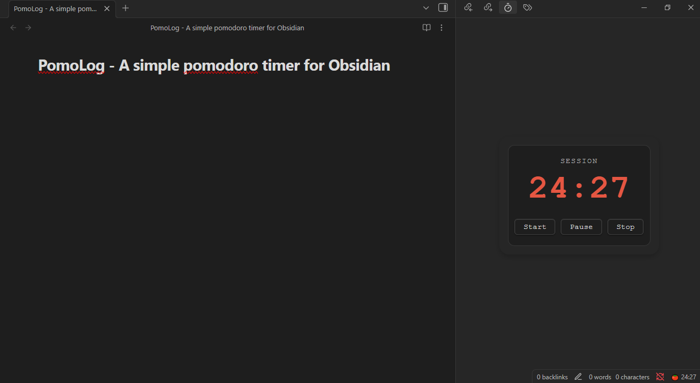

# PomoLog for Obsidian

A powerful Pomodoro timer and session logger built directly into Obsidian. Stay focused and track your work without leaving your vault.

---

### Key Features

-   **Visual Timer:** A clean, modern timer in the sidebar.
-   **Automatic Logging:** Completed sessions are logged to a Markdown note.
-   **Tag-based Tracking:** Assign tags to sessions to see where your time goes.
-   **Built-in Statistics:** Analyze your focus time for today, this week, and all-time.
-   **Audio Cues:** Optional ticking, white noise, and completion sounds.
-   **Mobile Friendly:** Works on Obsidian Mobile.

### Installation

1.  Go to the [**Latest Release**](https://github.com/justzen0/PomoLog/releases).
2.  Download `main.js`, `manifest.json`, `styles.css`, and the `media` folder.
3.  Create a folder named `PomoLog` in your vault's plugins folder (`YourVault/.obsidian/plugins/`).
4.  Copy the downloaded files and the `media` folder into the `PomoLog` folder.
5.  In Obsidian's settings, reload and enable the "PomoLog" plugin.

### Contributing

Found a bug or have a feature request? Feel free to [open an issue](https://github.com/justzen0/PomoLog/issues).

### License

[MIT](LICENSE)